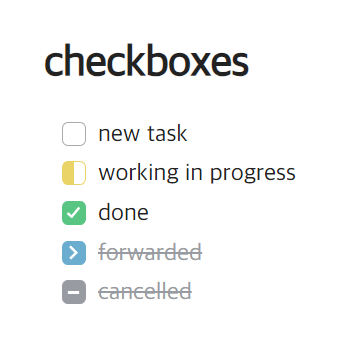

# obsidian-checkbox-css

A simple **CSS snippet** for *Obsidian*(v1.5.3). 

Works on both editing(live preview mode) and reading view.




```
- [ ] new task
- [/] working in progress
- [x] done
- [>] forwarded
- [-] cancelled   
```

## Installation
- Download [obsidian-checkbox.css](obsidian-checkbox.css) 
- In Obsidian, open `Settings` > `Appearance` > `CSS snippets`
- Click the folder icon to open the snippets folder (`your_vault/.obsidian/snippets/`, a hidden folder)
- Copy css file there
- Reload Obsidian
- Go back to the `CSS snippets` settings and enable the snippet